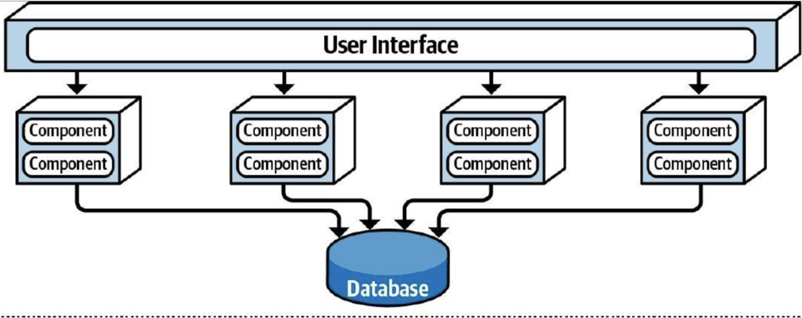

# System Architecture Design

## 1. Overall Architecture

### 1.1 Architectural Style

This project adopts a Service-Based Architecture (SBA). The system is divided into several independent services based on business domains and functions. Each service has clear responsibility boundaries, can select an appropriate technology stack according to business requirements, and communicates through protocols such as HTTP and gRPC.

Rationale:

- Compared with a monolithic architecture, this project has a relatively large business scope, clearly separated service domains, and a need for multiple technology stacks. SBA provides greater flexibility in technology selection and better module decoupling.
- Compared with a microservices architecture, this project does not require complex service governance infrastructure or overly fine-grained service decomposition. Its simpler architecture is better suited to the current project scale.

### 1.2 Topology

## 2. Internal Service Layers

## 3. Business Service Responsibilities

This section describes the responsibility boundaries and data ownership of the Project, Asset, and AI business services. Data structures and interface definitions are maintained in the corresponding service design documents.

### 3.1 Project Service

The Project Service manages the project lifecycle and project-level configuration, including:

- Creating projects
- Retrieving the current user's project list
- Retrieving project details
- Updating project configuration
- Maintaining project-level information such as game type, view type, art style, description, and reference images

The Project Service owns Project-related data. When a project reference image needs to be generated, the application layer calls the AI Service. The Project domain model does not depend directly on a specific model provider.

Data structures: [Project Service](<data structure/project.md>); interfaces: [Project Service](interfaces/project.md)

### 3.2 Asset Service

The Asset Service manages the lifecycle, organizational relationships, and versions of assets within a project, including:

- Creating or duplicating one or more assets
- Querying assets by project, type, tag, or name
- Retrieving and updating asset details
- Deleting assets
- Establishing relationships between assets
- Managing asset tags
- Creating, querying, and restoring historical asset versions

The Asset Service owns data related to `Asset`, `AssetResource`, `AssetSnapshot`, and `AssetRecord`. Other services must not bypass the Asset Service to modify this data directly.

Data structures: [Asset Service](<data structure/asset.md>); interfaces: [Asset Service](interfaces/asset.md)

### 3.3 AI Service

The AI Service provides content-generation capabilities to other business services and external callers, including:

- Generating character assets
- Generating UI elements
- Generating scenes and layers
- Generating tile sets
- Generating objects
- Generating animations
- Generating project reference images

The AI Service organizes generation tasks and invokes models, but it does not own Project or Asset business data. When a generated result needs to be stored as an asset, the appropriate application service should coordinate with the Asset Service.

Data structures: [AI Service](<data structure/ai.md>); interfaces: [AI Service](interfaces/ai.md)

## 4. Access Infrastructure

### 4.1 Gateway Responsibilities

The Gateway provides a unified system entry point for frontend and external callers. Nginx is used as the initial Gateway implementation.

The Gateway is responsible for:

- Forwarding requests to the appropriate backend service
- Terminating TLS connections
- Forwarding user authentication information
- Handling cross-origin requests
- Limiting request body size
- Enforcing rate limits
- Controlling request timeouts
- Recording access logs and request tracing information

### 4.2 Boundary Constraints

The Gateway is part of the access infrastructure. It is not a business service and does not contain Project, Asset, or AI domain logic.

The Gateway must not:

- Access any business service database directly
- Execute business rules for assets, projects, or generation tasks
- Call external model providers directly
- Determine cross-service workflows based on business state
- Modify the semantics of data returned by business services

The Gateway may forward authentication information, but the corresponding business service remains responsible for validating access permissions for specific resources.

### 4.3 Request Routing and Service Orchestration
