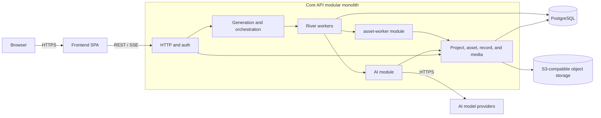

# System Architecture Design

## 1. Architecture Decision

The system uses a modular monolith with two application components:

| Component | Deployment shape    | Core responsibility                                                                                   |
| --------- | ------------------- | ----------------------------------------------------------------------------------------------------- |
| Frontend  | Static SPA          | Project, asset, editor, progress, and confirmation UI                                                 |
| Core API  | Go modular monolith | HTTP API, auth, business logic, AI integration, media processing, job execution, persistence, and SSE |

AI generation and deterministic asset processing are modules inside Core API. They are not independently deployed services. PostgreSQL is the system of record and also backs River jobs, so the system does not require a message broker or Redis.

### 1.1 Overall system architecture



PostgreSQL and object storage are infrastructure dependencies, not additional application services.

### 1.2 Boundaries

- The browser loads the Frontend and sends all business requests to Core API.
- Core API owns all business data and state transitions.
- The `ai` and `asset-worker` modules communicate with other modules through in-process interfaces.
- Long-running work is persisted and executed with River using the same PostgreSQL database.
- Binary media does not enter River job arguments. Jobs contain stable object-storage references and required parameters only.
- AI provider SDKs and media libraries remain behind module adapters so domain code does not depend on vendor-specific APIs.

## 2. Technology Selection

| Area                       | Technology                                             |
| -------------------------- | ------------------------------------------------------ |
| Frontend                   | React, TypeScript, Vite                                |
| Routing/server state/forms | TanStack Router, TanStack Query, TanStack Form         |
| Client state/UI            | Zustand, Tailwind CSS, shadcn/ui                       |
| Core API                   | Go, Echo, GORM, PostgreSQL                             |
| Job processing             | River with the `riverdatabasesql` driver on PostgreSQL |
| Object storage             | Replaceable S3 SDK                                     |
| Gateway                    | Caddy                                                  |
| HTTP contract              | OpenAPI 3.1                                            |
| Code generation            | Hey API, oapi-codegen                                  |
| Initial deployment         | Docker Compose                                         |

Not introduced: separate AI or asset-worker services, NATS, Redis, Kafka, Kubernetes, Next.js, SSR, React Server Components, LangChain, or LangGraph.

## 3. Frontend

### 3.1 Responsibility

Frontend is a static SPA with no Node.js server. It handles forms, asset lists and details, pixel previews, editor interactions, job progress, and candidate confirmation.

### 3.2 State boundaries

- TanStack Router: routes, Asset type, pagination, search, Tag filters, current Record, and editor tab.
- TanStack Query: server state for Project, Asset, Record, jobs, and media resources.
- TanStack Form: create/edit forms, dynamic fields, async validation, arrays, and nested fields.
- Zustand: selected Sprite, canvas zoom, layer visibility, current frame, playback speed, local unsubmitted edits, and sidebar state.

Do not copy Query data into Zustand. State that belongs in the URL should stay out of Zustand.

### 3.3 OpenAPI and code generation

The only HTTP contract source is:

```text
contracts/openapi/openapi.yaml
```

```text
openapi.yaml
├── oapi-codegen → Go DTOs and server interfaces
└── Hey API → TypeScript SDK, Zod, and TanStack Query
```

Generated code lives in `generated` and is not edited manually. OpenAPI defines interface shape and basic validation; form grouping, widgets, previews, and complex interactions belong to frontend configuration and custom components.

## 4. Core API

### 4.1 Stack and modules

Core API uses Go, Echo, GORM, PostgreSQL, River with the `riverdatabasesql` driver, the AWS SDK for Go, and goose.

| Module            | Responsibility                                                                                                                   |
| ----------------- | -------------------------------------------------------------------------------------------------------------------------------- |
| `authentication`  | Login, sessions, permissions, and membership                                                                                     |
| `project`         | Project lifecycle and project-level configuration                                                                                |
| `asset`           | Current asset and Record state, resource dependencies, version snapshots, and restoration                                    |
| `generation`      | Generation requests, plans, Step state, dependency scheduling, retry, cancellation, and candidate confirmation                   |
| `ai`              | Prompt construction, constrained LLM planning, provider calls, AI image/audio generation and editing, usage, and cost collection |
| `asset-worker`    | Deterministic image/audio processing, pixel normalization, validation, animation and sheet building, and export packaging        |
| `media`           | Upload sessions, object keys, media metadata, access control, and associations                                                   |
| `taxonomy`        | Tags, asset associations, search, and filtering                                                                                  |
| `export`          | Export specifications and manifests                                                                                              |
| `jobs`            | River job definitions, insertion, execution, progress, retry policy, and cancellation                                            |

Module boundaries are code-ownership boundaries, not network boundaries. The `generation` module coordinates work through application interfaces and enqueues River jobs; job handlers call the `ai` or `asset-worker` application services directly.

### 4.2 AI module

The `ai` module handles:

- Project Context assembly and Prompt templates.
- LLM task decomposition with a constrained plan.
- Image/audio generation, AI editing, complex background removal, semantic segmentation, and mask generation.
- Provider adapters, model cost, and usage collection.

Provider adapters isolate vendor SDKs. Plans must be validated for allowed Step types, dependencies, budget, retry count, and access scope. The module does not own Project or Asset CRUD, version creation, deterministic processing, or export packaging.

Existing AI contracts remain the detailed source of truth:

- [AI data structures](<data structure/ai.md>)
- [AI interfaces](interfaces/ai.md)

These contracts describe the internal module and its provider ports; references to an AI Service should be interpreted as the Core API `ai` module.

### 4.3 asset-worker module

The `asset-worker` module handles deterministic operations:

- Image and Alpha inspection, transparent-edge trimming, and color-key removal.
- Nearest-neighbor resize, pixel-grid alignment, binary Alpha, and PNG encoding.
- GIF/APNG, Spritesheet, TileSet, audio trim, and speed change.
- ZIP, Manifest, hashing, format, and dimension validation.

It does not run LLMs or semantic models. Complex background removal and semantic segmentation belong to the `ai` module.

Current support is limited to `render_style = pixel_art` and `alpha_mode = binary`:

- Final Alpha is only `0` or `255`.
- Resize uses nearest neighbor only; bilinear, bicubic, Lanczos, and automatic anti-aliasing are forbidden.
- Frame dimensions are integer pixels; Spritesheets use strict grid alignment.
- Raw results are retained; post-processing creates new media objects.
- Frames in one animation share Canvas, Pivot, and coordinate system.

### 4.4 Persistence constraints

- Core API is the only business-data writer.
- GORM handles normal CRUD, relationship queries, transactions, and pagination; complex cases may use Raw SQL.
- Production does not use `AutoMigrate`; SQL migrations use goose.
- Keep OpenAPI DTOs, domain models, and GORM entities separate:

```text
OpenAPI DTO → Echo Handler → Application Service → Domain Model → GORM Entity
```

- Pass `context.Context` explicitly to all writes.
- Guard critical state transitions with the previous state to prevent duplicate job execution from overwriting state.

### 4.5 Authoritative data structures

This document defines architecture boundaries only. It does not redefine entity fields. Use the local documents as the source of truth:

- [Project data structures](<data structure/project.md>) and [Project interfaces](interfaces/project.md)
- [Asset data structures](<data structure/asset.md>) and [Asset interfaces](interfaces/asset.md)

The current definitions are `Project`, `Asset`, `AssetResource`, `AssetSnapshot`, and `AssetRecord` in those documents.

## 5. Job Processing with River

### 5.1 Execution flow

```text
Core API request
→ validate request and persist business state
→ insert a River job in the same PostgreSQL transaction
→ River worker invokes an internal module
→ persist result and progress
→ enqueue the next ready Step when required
→ publish progress to the Frontend through SSE
```

GenerationRun states:

```text
pending → planning → planned → running → post_processing
→ waiting_confirmation → completed
```

Terminal states are `failed` and `cancelled`. Step states are `pending`, `ready`, `running`, `succeeded`, `failed`, `retry_wait`, `cancelled`, and `skipped`.

### 5.2 Job constraints

- Insert the business-state change and its River job in one database transaction. Configure River with `riverdatabasesql` so GORM writes and `InsertTx` share the same `*sql.Tx`. No transactional Outbox is needed.
- Job arguments contain IDs, object keys, operation type, and bounded parameters; they do not contain binary media, provider credentials, oversized Prompts, or long-lived Presigned URLs.
- Handlers must be idempotent because River jobs may be retried.
- Use River's attempt limits and backoff for transient failures. Store domain-specific failure details on the GenerationRun or Step.
- Cancellation updates domain state and prevents pending work from starting. Running provider calls should use `context.Context` cancellation where supported.
- Limit worker concurrency separately for AI provider calls and CPU-heavy media processing.
- Core API serves HTTP and runs River workers in the same deployment. A separate worker deployment is not part of the initial architecture.

## 6. Object Storage

The system uses a replaceable S3 SDK. The database stores stable identifiers such as bucket, object key, and checksum, not provider public URLs. Object keys are server-generated:
`workspaces/{workspace_id}/projects/{project_id}/artifacts/{artifact_id}/{variant}.{extension}`

Upload flow: Frontend requests an upload from Core API → receives a Presigned URL → uploads directly to S3 → reports completion → Core API validates the object and stores media metadata. Large files do not pass through Core API or Caddy.
