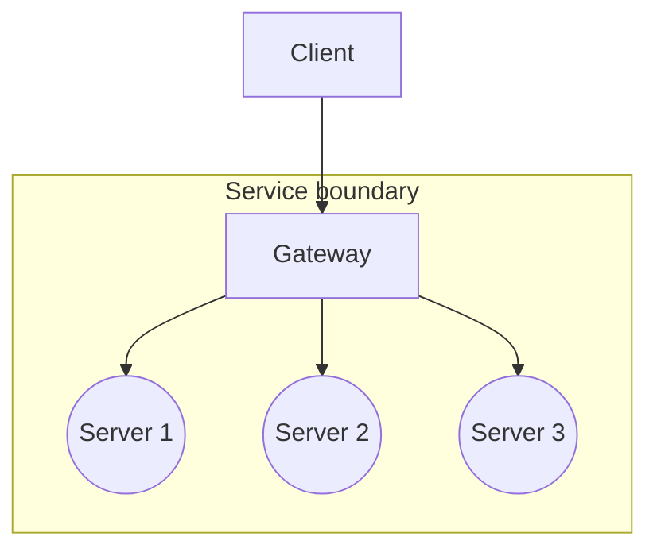

# System Architecture Design

## Overall Architecture

The system uses a microservices architecture. The User, Project, and AI modules are separated into independent services and accessed through a unified Gateway entry point.



The source diagram labels the backend services generically as `server1`, `server2`, and `server3`; it does not define a one-to-one mapping between those services and the business modules.

## Module Breakdown

### 1. Project

#### Functions

- Create a project
- Retrieve the project list
- Retrieve project details
- Update project configuration

#### Interfaces

````go
type GameType string
type ViewType string

const (
    GameTypeRPG GameType = "RPG"
    GameTypeACT GameType = "ACT"
    GameTypeSLG GameType = "SLG"
    GameTypeOther GameType = "Other"

    ViewTypeTopDown ViewType = "TopDown"
    ViewTypeSideView ViewType = "SideView"
    ViewTypeIsometric ViewType = "Isometric"
)

type Project struct {
    ID          uint
    Name        string
    GameType    GameType `json:"gameType"`    // RPG, ACT, SLG, ...
    ViewType    ViewType `json:"viewType"`    // TopDown, SideView, Isometric, ...
    Description string                       // Project description
    Reference   string                       // AI-generated reference image based on the project description
    Style       string                       // Art style of the project
}

type ProjectService interface {
    Create(ctx context.Context, project *Project) error
    // Get project list by User ID
    ListByUid(ctx context.Context, uid uint) ([]*Project, error)
    // GetDetail returns the details of the project.
    GetDetail(ctx context.Context, id uint) (*Project, error)
    Update(ctx context.Context, project *Project) error
}
````

### 2. Asset

#### Functions

- Create or duplicate one or more assets
- Query assets by type, tag, or name
- Delete an asset
- Retrieve asset details
- Search assets
- Create relationships between assets
- Add a tag
- Delete a tag
- Update a tag

#### Interfaces

No interface definitions are provided in the source document for the Asset module.

### 3. AI

#### Functions

- Generate characters
- Generate UI elements
- Generate scenes
- Generate objects
- Generate animations
- Generate reference images

#### Interfaces

````go
type Size struct {
    Width  int `json:"width"`
    Height int `json:"height"`
}

type CharacterGenerationRequest struct {
    ProjectPrompt string        `json:"projectPrompt"` // Project prompt
    UserPrompt    string        `json:"userPrompt"`
    Name          string        `json:"name"`
    Facing        string        `json:"facing"`
    Size          Size          `json:"size"`
    Reference     []string      `json:"reference"`
    Physics       PhysicsConfig `json:"physics"`
}

type PhysicsConfig struct {
    Collision CollisionConfig `json:"collision"`
    Movement  MovementConfig  `json:"movement"`
    Gravity   GravityConfig   `json:"gravity"`
}

type CreateUIRequest struct {
    ProjectPrompt string   `json:"projectPrompt"` // Project prompt
    UserPrompt    string   `json:"user_prompt"`
    Type          string   `json:"type"`           // button, panel, hp_bar
    Size          Size     `json:"size"`
    Reference     []string `json:"reference"`
}

type CreateUIResponse struct {
    URL string `json:"url"`
}

type LayerResult struct {
    ID  uint   `json:"id"`  // Layer ID
    Url string `json:"url"` // Generated image URL
}

type CreateSceneRequest struct {
    ProjectPrompt string  `json:"projectPrompt"` // Project prompt
    Style         string  `json:"style"`         // Style of the scene
    Layers        []Layer `json:"layers"`        // Layers of the scene
}

type CreateSceneResponse struct {
    Layers []LayerResult `json:"layers"` // Results for each layer
}

type CreateTileSetRequest struct {
    ProjectPrompt string   `json:"projectPrompt"` // Project prompt
    Prompt        string   `json:"prompt"`        // Prompt for the tile set
    Reference     []string `json:"reference"`     // Reference images for tile set creation
}

type CreateTileSetResponse struct {
    Url string `json:"url"` // Generated tile set image URL
}

type MapService interface {
    CreateScene(request *CreateSceneRequest) (*CreateSceneResponse, error)
    CreateTileSet(request *CreateTileSetRequest) (*CreateTileSetResponse, error)
}

type CreateObjectRequest struct {
    UserPrompt    string   `json:"prompt"`        // Prompt for the object
    ProjectPrompt string   `json:"projectPrompt"` // Project prompt
    Derictions    int      `json:"derictions"`    // Number of directions for the object (e.g. 1, 4, 8)
    Reference     string   `json:"reference"`     // Reference image for object creation
    Size          Size     `json:"size"`          // Size of the object (e.g. "32X32", "64X64")
    View          ViewType `json:"view"`          // View type of the object (e.g. "TopDown", "SideView", "Isometric")
}

type CreateObjectResponse struct {
    Url string `json:"url"` // Generated object image URL
}

type ObjectService interface {
    CreateObject(request *CreateObjectRequest) (*CreateObjectResponse, error)
}
````

### 4. Gateway

#### Function

The Gateway chains the individual services together, simplifies their usage, and exposes the resulting interfaces to the frontend.
