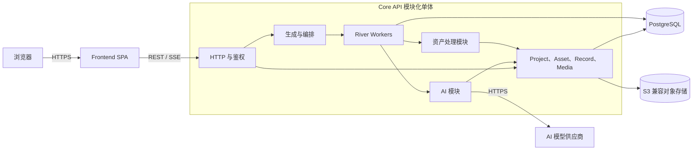

# 系统架构设计

## 1. 架构结论

系统采用模块化单体架构，只包含两个应用组件：

| 组件 | 部署形态 | 核心职责 |
| --- | --- | --- |
| Frontend | 静态 SPA | 项目、资产、编辑器、进度和候选结果确认 UI |
| Core API | Go 模块化单体 | HTTP API、鉴权、业务逻辑、AI 集成、媒体处理、任务执行、持久化和 SSE |

AI 生成和确定性资产处理都是 Core API 内的模块，不单独部署。PostgreSQL 同时作为业务数据源和 River 任务存储，因此不需要消息代理或 Redis。

### 1.1 系统总体架构



PostgreSQL 和对象存储是基础设施依赖，不是额外的应用服务。

### 1.2 边界

- 浏览器加载 Frontend，所有业务请求发送到 Core API。
- Core API 持有全部业务数据并负责状态转换。
- `ai` 和 `asset-worker` 通过进程内接口与其他模块通信。
- 长任务使用 River 持久化并执行，任务和业务数据使用同一个 PostgreSQL。
- 二进制媒体不进入 River 任务参数；任务只携带稳定的对象存储引用和必要参数。
- AI Provider SDK 和媒体处理库通过模块适配器隔离，领域代码不依赖供应商 API。

## 2. 技术选型

| 部分 | 技术 |
| --- | --- |
| Frontend | React、TypeScript、Vite |
| 路由/服务端状态/表单 | TanStack Router、TanStack Query、TanStack Form |
| 客户端状态/UI | Zustand、Tailwind CSS、shadcn/ui |
| Core API | Go、Echo、GORM、PostgreSQL |
| 任务处理 | River + `riverdatabasesql` 驱动 + PostgreSQL |
| 对象存储 | 可替换的 S3 SDK |
| 网关 | Caddy |
| HTTP 契约 | OpenAPI 3.1 |
| 代码生成 | Hey API、oapi-codegen |
| 首版部署 | Docker Compose |

当前不引入：独立 AI 或 Asset Worker 服务、NATS、Redis、Kafka、Kubernetes、Next.js、SSR、React Server Components、LangChain 和 LangGraph。

## 3. Frontend

### 3.1 职责

Frontend 是静态 SPA，不运行 Node.js 服务端。负责表单、资产列表与详情、像素预览、编辑器交互、任务进度和候选结果确认。

### 3.2 状态边界

- TanStack Router：路由、Asset 类型、分页、搜索、Tag 筛选、当前 Record 和编辑 Tab。
- TanStack Query：Project、Asset、Record、任务和媒体资源等服务端状态。
- TanStack Form：创建和编辑表单、动态字段、异步校验、数组和嵌套字段。
- Zustand：选中 Sprite、画布缩放、图层显示、当前帧、播放速度、未提交编辑和侧边栏等客户端状态。

Query 数据不复制到 Zustand；适合放入 URL 的状态不放入 Zustand。

### 3.3 OpenAPI 与代码生成

唯一 HTTP 契约来源：

```text
contracts/openapi/openapi.yaml
```

```text
openapi.yaml
├── oapi-codegen → Go DTO、Server Interface
└── Hey API → TypeScript SDK、Zod、TanStack Query
```

生成代码统一放入 `generated` 目录，禁止手动编辑。OpenAPI 负责接口结构和基础校验；表单分组、Widget、预览和复杂交互由前端配置及自定义组件负责。

## 4. Core API

### 4.1 技术栈与模块

Core API 使用 Go、Echo、GORM、PostgreSQL、River（`riverdatabasesql` 驱动）、AWS SDK for Go 和 goose。

| 模块 | 职责 |
| --- | --- |
| `authentication` | 登录、Session、权限和成员管理 |
| `project` | Project 生命周期和项目级配置 |
| `asset` | Asset 与 Record 当前状态、资源依赖、版本快照和历史恢复 |
| `generation` | 生成请求、计划、Step 状态、依赖调度、重试、取消和候选确认 |
| `ai` | Prompt 构建、受约束的 LLM 规划、Provider 调用、AI 图像/音频生成与编辑、用量和成本采集 |
| `asset-worker` | 确定性图像/音频处理、像素规范化、校验、动画与图集构建、导出打包 |
| `media` | 上传会话、对象键、媒体元数据、访问控制和关联 |
| `taxonomy` | Tag、资产关联、搜索和筛选 |
| `export` | 导出规格和 Manifest |
| `jobs` | River 任务定义、插入、执行、进度、重试策略和取消 |

模块边界是代码所有权边界，不是网络边界。`generation` 通过应用接口编排工作并插入 River 任务；任务处理器直接调用 `ai` 或 `asset-worker` 应用服务。

### 4.2 AI 模块

`ai` 模块负责：

- 组装 Project Context 和 Prompt 模板。
- LLM 任务拆解，输出受约束的计划。
- 图像/音频生成、AI 编辑、复杂去背景、语义分割和 Mask 生成。
- Provider 适配、模型成本和用量采集。

Provider 适配器隔离供应商 SDK。计划必须校验 Step 类型、依赖、预算、重试次数和访问范围。该模块不负责 Project 或 Asset CRUD、版本创建、确定性处理或导出打包。

详细内部契约参见：[AI 数据结构](<data structure/ai.md>)、[AI 接口](interfaces/ai.md>)。

这些文档中的 AI Service 应理解为 Core API 内的 `ai` 模块及其 Provider 端口。

### 4.3 资产处理模块

`asset-worker` 模块负责确定性操作：

- 图片和 Alpha 检测、透明边缘裁剪、颜色去背景。
- 最近邻缩放、像素网格对齐、Alpha 二值化和 PNG 编码。
- GIF/APNG、Spritesheet、TileSet、音频裁剪和倍速。
- ZIP、Manifest、哈希、格式和尺寸校验。

该模块不运行 LLM 或语义模型；复杂背景去除和语义分割由 `ai` 模块处理。

当前仅支持 `render_style = pixel_art` 和 `alpha_mode = binary`：

- 最终 Alpha 只能是 `0` 或 `255`。
- 缩放只使用最近邻；禁止双线性、双三次、Lanczos 和自动抗锯齿。
- 帧尺寸必须是整数像素；Spritesheet 使用严格网格对齐。
- 保留原始结果；后处理生成新的媒体对象。
- 同一动画中的帧共享 Canvas、Pivot 和坐标系。

### 4.4 持久化约束

- Core API 是业务数据唯一写入方。
- GORM 负责常规 CRUD、关系查询、事务和分页；复杂查询可使用 Raw SQL。
- 生产环境不使用 `AutoMigrate`，SQL Migration 使用 goose。
- OpenAPI DTO、领域模型和 GORM Entity 分离：

```text
OpenAPI DTO → Echo Handler → Application Service → Domain Model → GORM Entity
```

- 所有写操作显式传递 `context.Context`。
- 关键状态更新必须带原状态条件，避免重复任务覆盖状态。

### 4.5 数据结构权威来源

本文只定义架构边界，不重新定义实体字段。数据结构以本地文档为准：

- [Project 数据结构](<data structure/project.md>) 与 [Project 接口](interfaces/project.md)
- [Asset 数据结构](<data structure/asset.md>) 与 [Asset 接口](interfaces/asset.md)

上述文档中的 `Project`、`Asset`、`AssetResource`、`AssetSnapshot` 和 `AssetRecord` 是当前有效定义。

## 5. 使用 River 的任务处理

### 5.1 执行流程

```text
Core API 请求
→ 校验请求并持久化业务状态
→ 在同一个 PostgreSQL 事务中插入 River 任务
→ River Worker 调用内部模块
→ 保存结果和进度
→ 按需插入下一个可执行 Step
→ 通过 SSE 向 Frontend 推送进度
```

GenerationRun 状态：

```text
pending → planning → planned → running → post_processing
→ waiting_confirmation → completed
```

终态为 `failed` 和 `cancelled`。Step 状态为 `pending`、`ready`、`running`、`succeeded`、`failed`、`retry_wait`、`cancelled` 和 `skipped`。

### 5.2 任务约束

- 业务状态变更和 River 任务必须在同一个数据库事务中完成。配置 `riverdatabasesql` 后，GORM 写入与 `InsertTx` 可共享同一个 `*sql.Tx`，不需要事务 Outbox。
- 任务参数只包含 ID、对象键、操作类型和有界参数；不包含二进制、Provider 密钥、超大 Prompt 或长期 Presigned URL。
- 处理器必须幂等，因为 River 可能重试任务。
- 使用 River 的尝试次数限制和退避处理临时错误；GenerationRun 或 Step 保存领域错误详情。
- 取消操作更新领域状态并阻止未开始的任务；运行中的 Provider 调用应在支持时使用 `context.Context` 取消。
- AI Provider 调用和 CPU 密集型媒体处理分别限制 Worker 并发度。
- Core API 在同一部署中提供 HTTP 服务并运行 River Worker，首版不拆分独立 Worker 部署。

## 6. 对象存储

系统使用可替换的 S3 SDK。数据库保存 bucket、object key 和 checksum 等稳定标识，不保存供应商公开 URL。Object key 由服务端生成：

```text
workspaces/{workspace_id}/projects/{project_id}/artifacts/{artifact_id}/{variant}.{extension}
```

上传流程：Frontend 向 Core API 申请上传 → 获得 Presigned URL → 直传 S3 → 通知完成 → Core API 校验对象并保存媒体元数据。大文件不经过 Core API 或 Caddy。

## 7. 部署与运维

首版 Docker Compose 部署：

- Frontend 静态文件和 Caddy。
- 一个包含 HTTP Handler、全部业务模块和 River Worker 的 Core API 应用。
- 用于业务数据和 River 任务的 PostgreSQL。
- 用于二进制媒体的 S3 兼容对象存储。

Session、验证码、上传状态、幂等记录和持久化任务状态均存储在 PostgreSQL。只有在丢失缓存内容可接受且允许多副本不一致时，才可使用进程内小缓存或限流器。

本部署明确排除 Redis、NATS JetStream、AI Service 和 Asset Worker。新增独立运行时组件前，必须证明模块化单体无法满足已测量的扩展性、隔离性或依赖要求，并记录新的架构决策。
